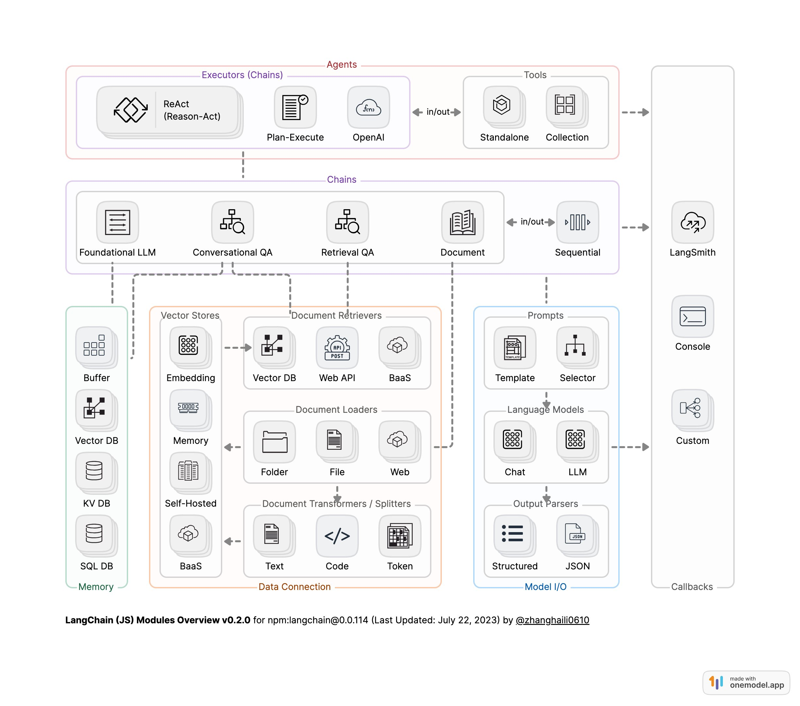
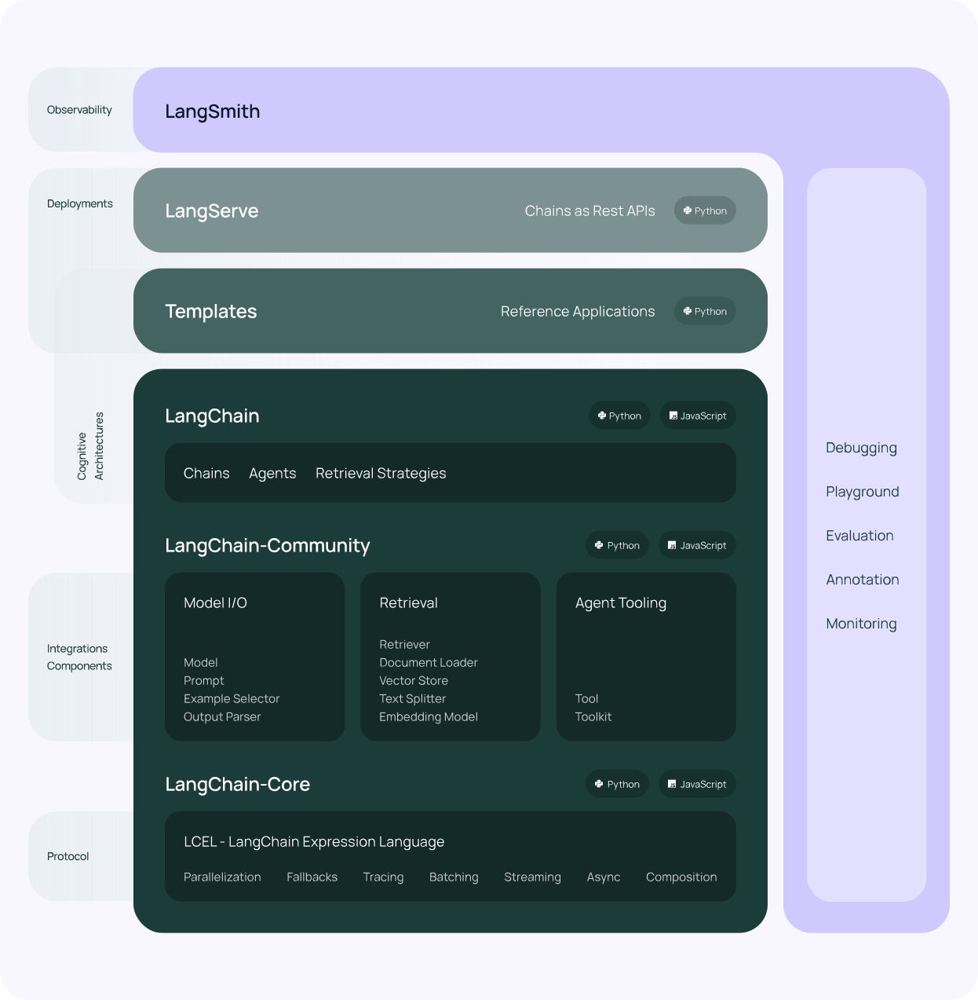

该Tutorials主要集中在大模型应用的主流技术，内容主要以官方教程为主，同时每一章给与详细介绍已经出处和来源。

### 1 langchain

langchain各个模块的关系如下：

* Model I/O
* Data Connection
* Memory
* Chain
* Agent
* Callbacks

图片来源：https://x.com/zhanghaili0610/status/1683316685489713152

**langchain的框架图：**

图片来源：https://www.langchain.asia/get_started/introduction

langchain近期将langchain拆分为langchain，langchain_core，同时社区提供的工具等汇聚到langchain_community.

* langchain_core保留llm的最小实现，Model I/O。
* langchain保留chain, tool, agent的实现。
* langchian_community提供Retrievel等实现（数据载入，数据切分，向量编码，向量数据库，检索器）

### 1.1 quickstart

用于langchain的入门介绍，在这个快速入门中，我们将向您展示如何：

- 设置LangChain、LangSmith和LangServe
- 使用LangChain的最基本和常见的组件：提示模板、模型和输出解析器
- 使用LangChain表达语言，这是LangChain构建的协议，也是组件链接的基础
- 使用LangChain构建一个简单的应用程序
- 使用LangSmith跟踪您的应用程序
- 使用LangServe为您的应用程序提供服务

来源https://www.langchain.asia/get_started/quickstart