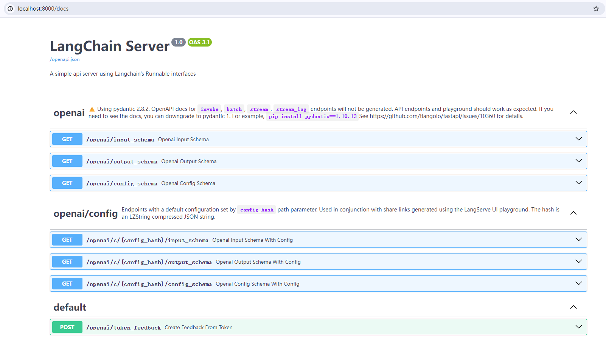
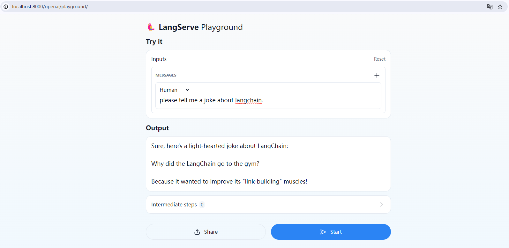

[LangServe](https://github.com/langchain-ai/langserve) helps developers deploy `LangChain` [runnables and chains](https://python.langchain.com/docs/expression_language/) as a REST API.

This library is integrated with [FastAPI](https://fastapi.tiangolo.com/) and uses [pydantic](https://docs.pydantic.dev/latest/) for data validation.

我们根据LangServe的指引快速构建服务。

```python
#!/usr/bin/env python
from fastapi import FastAPI
from langchain.prompts import ChatPromptTemplate
from langchain.chat_models import ChatAnthropic, ChatOpenAI
from langserve import add_routes

api_key = "your api_key"
base_url = "https://api.deepseek.com"

app = FastAPI(
    title="LangChain Server",
    version="1.0",
    description="A simple api server using Langchain's Runnable interfaces",
)

add_routes(
    app,
    ChatOpenAI(model="deepseek-chat", api_key=api_key, base_url=base_url),
    path="/openai",
)

if __name__ == "__main__":
    import uvicorn

    uvicorn.run(app, host="localhost", port=8000)
```

LANGSERVE: Playground for chain "/openai/" is live at:
LANGSERVE:  │
LANGSERVE:  └──> /openai/playground/
LANGSERVE:
LANGSERVE: See all available routes at /docs/



