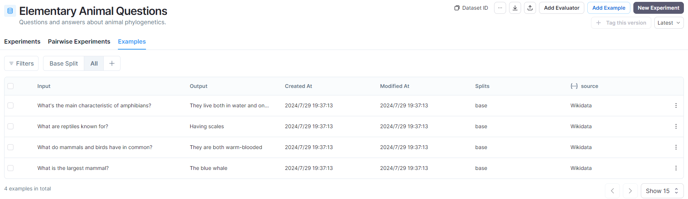

LangSmith docs: https://docs.smith.langchain.com/how_to_guides/datasets

LangSmith可以通过编程和界面创建数据集。

## 1 LangSmith编程创建数据集

Dataset的数据来源有很多：

* 1 list of values
* 2 list of traces
* 3 list of csv file
* ......

### 1.1 list of values

```python
from langsmith import Client

example_inputs = [
  ("What is the largest mammal?", "The blue whale"),
  ("What do mammals and birds have in common?", "They are both warm-blooded"),
  ("What are reptiles known for?", "Having scales"),
  ("What's the main characteristic of amphibians?", "They live both in water and on land"),
]

client = Client()
dataset_name = "Elementary Animal Questions"

# Storing inputs in a dataset lets us
# run chains and LLMs over a shared set of examples.
dataset = client.create_dataset(
    dataset_name=dataset_name, description="Questions and answers about animal phylogenetics.",
)
for input_prompt, output_answer in example_inputs:
    client.create_example(
        inputs={"question": input_prompt},
        outputs={"answer": output_answer},
        metadata={"source": "Wikipedia"},
        dataset_id=dataset.id,
    )
```

### 1.2 list of traces

```python
from langsmith import Client

client = Client()
dataset_name = "Example Dataset"

# Filter runs to add to the dataset
runs = client.list_runs(
    project_name="my_project",
    is_root=True,
    error=False,
)

dataset = client.create_dataset(dataset_name, description="An example dataset")
for run in runs:
    client.create_example(
        inputs=run.inputs,
        outputs=run.outputs,
        dataset_id=dataset.id,
    )
```

### 1.3 list of csv file

```python
from langsmith import Client
import os

client = Client()

csv_file = 'path/to/your/csvfile.csv'
input_keys = ['column1', 'column2'] # replace with your input column names
output_keys = ['output1', 'output2'] # replace with your output column names

dataset = client.upload_csv(
    csv_file=csv_file,
    input_keys=input_keys,
    output_keys=output_keys,
    name="My CSV Dataset",
    description="Dataset created from a CSV file"
    data_type="kv"
)
```

more : https://docs.smith.langchain.com/how_to_guides/datasets/manage_datasets_programmatically

### 1.4 eg

```python
import os
from langsmith import Client

os.environ["LANGCHAIN_TRACING_V2"] = "True"
os.environ["LANGCHAIN_API_KEY"] = "your api_key"

example_inputs = [
  ("What is the largest mammal?", "The blue whale"),
  ("What do mammals and birds have in common?", "They are both warm-blooded"),
  ("What are reptiles known for?", "Having scales"),
  ("What's the main characteristic of amphibians?", "They live both in water and on land"),
]

client = Client()
dataset_name = "Elementary Animal Questions"

dataset = client.create_dataset(dataset_name, description="Questions and answers about animal phylogenetics.")
for input, output in example_inputs:
    client.create_example(
        inputs={"question": input},
        outputs={"answer": output},
        metadata={"source": "Wikidata"},
        dataset_id=dataset.id
    )

```



## 2 LangSmith界面创建数据集

docs: https://docs.smith.langchain.com/how_to_guides/datasets/manage_datasets_in_application