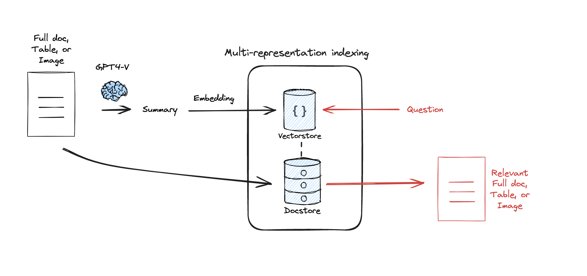

本教程内容整理自**[rag-from-scratch](https://github.com/langchain-ai/rag-from-scratch)**，经过二次编排，提供新的一种视角。

RAG的总览图如下：

**RAG可改进的地方：**

* 1 Query Translation
* 2 Prompt/DB Selection
* 3 DB
  * 3.1 Vector DB
    * Chunk Optimization
      * Charactres, Sections, Semantic, Delimiters
    * Specialized Embedding Model
      * ColBert
    * Multi-representation indexing
      * Unstructured
    * Heirachical indexing
      * RAPTOR
  * 3.2 Graph/Relational DB
    * Query Construction
      * Text2SQL
      * Text2Cypher
* 4 Retrieval
  * 4.1 Re-ranking - Cohere
  * 4.2 Active Retrieval - CRAG
    * llm inter -> vectorstore inter -> web data
* 5 Generation
  * 5.1 Self-RAG

## 1 Query Translation

用户query是RAG的起始，如果我们能对用户query进行加工，能很好的增加召回概率。

Query Translation的方式按照改写形式分为以下三类：

* 1 抽象：Step-back, HyDE
* 2 multi：Multi-Query，RAG-Fusion
* 3 具象：Decomposition

code：https://github.com/langchain-ai/rag-from-scratch/blob/main/rag_from_scratch_5_to_9.ipynb

### 1.1 抽象派

#### 1.1.1 Step-back

Step-back的意思是将用户的query往前step一步，即不拘泥于问题本身，可以考虑问题的背景以及问题相关的知识。

**举个例子：**

Query：Jan Sindel’s was born in what country?

Step-back Query: what is Jan Sindel’s personal history?

通过这种Query改写方式将Query抽象化以获取更多知识。

Paper：https://arxiv.org/pdf/2310.06117.pdf

#### 1.1.2 HyDE

HyDE和Step-back的抽象的意味差不多，不过HyDE是根据Query进行二次创作，例如根据Query进行假说创作。

**举个例子：**

Query：Jan Sindel’s was born in what country?

HyDE Query：Please write a scientific paper passage to answer the question -> Answer

Paper：https://arxiv.org/abs/2212.10496

### 1.2 multi派

#### 1.2.1 Multi-Query

用户的query经过llm进行多次重写变成Q1，Q2，Q3分别进行RAG过程，召回的文档经过过滤去重后和query一起输入给llm得到最后的answer。

Docs：https://python.langchain.com/docs/modules/data_connection/retrievers/MultiQueryRetriever

#### 1.2.2 RAG-Fusion

RAG-Fusion的起始和Multi-query一致，都是将用户的query经过llm进行多次重写变成Q1，Q2，Q3分别进行RAG过程，但是在召回的文档后需要考虑频率和rank（不像Multi-query一样简单的去重）进行重排，整合后的文档和query一起输入给llm得到最后的answer。

Blog：https://towardsdatascience.com/forget-rag-the-future-is-rag-fusion-1147298d8ad1

### 1.3 具象派

具象派的意思是将问题具象化，即将一个大问题分解为多个子问题进行解决，使问题更加具体。

#### 1.3.1 Base Decomposition

Decomposition将问题分解为Q1，Q2，Q3，第一步，Q1进行RAG；第二步，Q2先进行RAG，然后将(完整问题),(执行过的问题Q1和答案Answer1),(Q2和Q2召回的文档)继续输入给llm得到Answer2,......

#### 1.3.2 Simpify Decomposition

该方法还可以简单化，即不需要经过串行的执行，直接将子问题召回的文档和子问题和query一起输给llm进行回复即可。

Paper：https://arxiv.org/pdf/2205.10625.pdf

## 2 Prompt/DB Selection

Query改写完之后，可以着手于Prompt和DB的选择，Prompt Selection决定了提问的相关性，DB Selection决定了数据的来源选择。

code: https://github.com/langchain-ai/rag-from-scratch/blob/main/rag_from_scratch_10_and_11.ipynb

### 2.1 Prompt Selection

我们假设系统为用户提供了N个Prompt Template，我们希望框架能够根据Query自动选择最符合主题的Prompt Template.

通过embedding model对Prompt Template进行编码与Query Embedding进行比较得到最相似的Prompt Template.

### 2.2 DB Selection

由于数据来源的丰富性，我们经常会拥有很多数据库，例如Graph DB, Vector DB。

与此同时有些问题依靠特定的DB是可以更加优雅的解决的，例如"2019年xx地区的降雨量是多少？"。这很明显通过关系数据库进行查询可以极快的解决问题，而不是通过向量知识库。

## 3 DB

2.2中我们已经初涉不同的数据库了，本章节按照RAG使用的DB类型分为两类：向量库和其他数据库。

code：https://github.com/langchain-ai/rag-from-scratch/blob/main/rag_from_scratch_12_to_14.ipynb

### 3.1 Vector DB

向量库可以讲的东西就多了，数据从文本变成向量的过程分为：

* data split
* data encoding
* data store

#### 3.1.1 Chunk Optimization

data split切分为chunk，但是这个chunk为多少合适呢。我们的目的是通过向量相似度尽可能检索出和用户query有相关性的chunk，如果chunk本身切分太细，这导致召回的chunk语义不连贯，如果chunk本身切分太粗，召回的chunk粒度太粗给llm提取有用信息带来麻烦，故市面上存在多种切分形式。

* Charactres：按照字符的长度来切分
* Sections：按照章节来切分
* Semantic：按照语义来切分
* Delimiters：按照特定的分割次来切分

#### 3.1.2 Specialized Embedding Model

data encoding，在某些特定的垂直场景可能我们需要微调过的Bert Encoding Model帮助我们更好的检索和Query相关性文档。这里比较著名的是斯坦福的ColBert。

#### 3.1.3 Multi-representation indexing

data store，由于真实世界95%的信息都是非结构化的，例如image, table等，故如果我们可以抽取table和image的信息并将其存入向量库，则对解决用户问题带来极大的帮助。

该方法分为两步：

* 1 将不同来源的image, table, full doc信息生成text sumary，将text sumary编码后存入sumary向量库 。
* 2 将不同来源的image, table, full doc进行编码存入知识向量库库。
* 3 sumary向量库作为meta data, 知识向量库库为source data。

#### 3.1.4 Heirachical indexing

data store，如下图所示通过聚类层级的构建document clusters，通过cluster summary作为meta data, raw document作为source data。通过层级的meta dta的索引找到处于叶子节点的source data。

### 3.2 Graph/Relational DB

#### 3.2.1 Query Construction

由于Graph/Relational DB这类DB无法接受text作为输入，故需要将text转为对应的查询语言，即：Text2SQL，Text2Cypher。

## 4 Retrieval

code：https://github.com/langchain-ai/rag-from-scratch/blob/main/rag_from_scratch_15_to_18.ipynb

### 4.1 Re-ranking

### 4.2 Active Retrieval

CRAG框架实现了Active Retrieval, 即该Retrieval会先查看llm内部的知识是否能解决问题，否则从向量库中检查向量库的知识能否解决问题，最后从web中search data解决问题。

llm inter -> vectorstore inter -> web data

## 5 Generation

Self-RAG：通过检查回复的质量决定是否对用户的query进行修改或者重新进行retriever以增加最后的回复质量。

code：https://github.com/langchain-ai/rag-from-scratch/blob/main/rag_from_scratch_15_to_18.ipynb

## 6 Evaluation

RAG Evaluation框架：Ragas