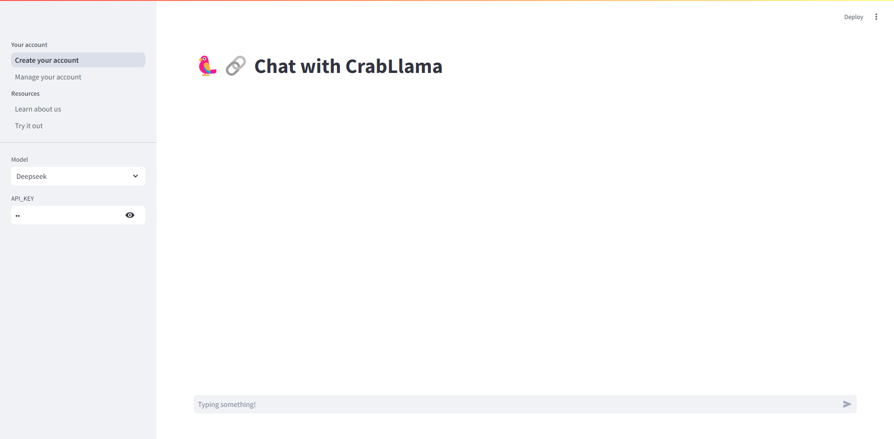
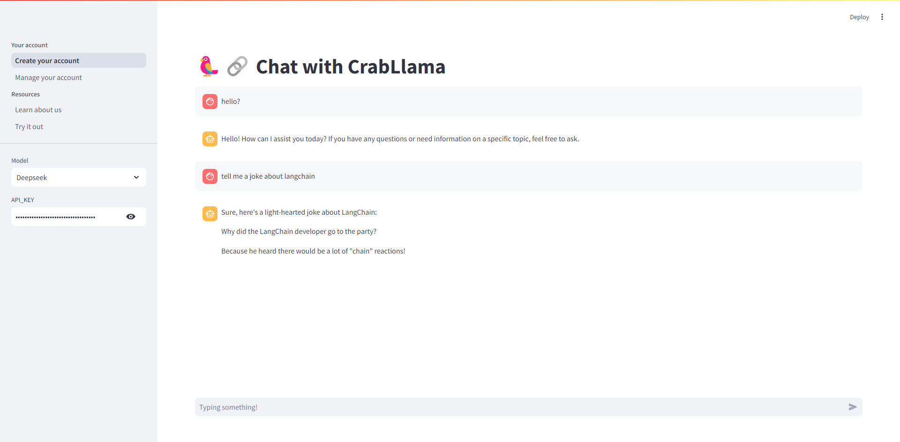

Streamlit是目前大火的python前端库，其使用组件构建前端的思想极大的解放了LLM从业者的精力，使其将精力多关注在LLM后端上。

Streamlit docs : https://docs.streamlit.io/

### 1 quickstart

首先将Streamlit和Langchain结合，实现携带历史记录和流式输出的示例。

基本上streamlit的项目都分为两步：

* 1 构建前端
* 2 嵌入后端

#### 1.1 code

```python
import streamlit as st
from langchain_openai import ChatOpenAI
from langchain_core.prompts import PromptTemplate
from langchain_core.messages import HumanMessage, AIMessage
from langchain.memory import ConversationBufferMemory
from langchain.chains.llm import LLMChain
from langchain.callbacks.streaming_stdout import StreamingStdOutCallbackHandler

# DEEPSEEK_API_KEY = "your api_key"
BASE_URL = "https://api.deepseek.com"
if "chat_history" not in st.session_state:
    st.session_state.chat_history = []

# 1 page
st.set_page_config(page_title="Welcome to ASL", layout="wide")
# 2 title
st.title('🦜🔗 Chat with CrabLlama')
# 3 navigation
pages = {
    "Your account": [
        st.Page("create_account.py", title="Create your account"),
        st.Page("manage_account.py", title="Manage your account"),
    ],
    "Resources": [
        st.Page("learn.py", title="Learn about us"),
        st.Page("trial.py", title="Try it out"),
    ],
}
pg = st.navigation(pages)
pg.run()

# 4 sidebar
with st.sidebar:
    option = st.selectbox("Model", ["Deepseek", "ChatGPT3.5", "GPT-4"])
    api_key = st.text_input("API_KEY", type="password")
# 5 body
if option == "Deepseek":
    llm = ChatOpenAI(model="deepseek-chat", api_key=api_key, base_url=BASE_URL)
elif option == "ChatGPT3.5":
    llm = ChatOpenAI(model="chatgpt3.5-turbo", api_key=api_key)
elif option == "GPT-4":
    llm = ChatOpenAI(model="gpt-4", api_key=api_key)

for chat_history in st.session_state.chat_history:
    if chat_history["role"] == "user":
        with st.chat_message("user"):
            st.markdown(chat_history["content"])
    elif chat_history["role"] == "assistant":
        with st.chat_message("assistant"):
            st.markdown(chat_history["content"])
input_text = st.chat_input("Typing something!")
if input_text:
    with st.chat_message("user"):
        st.markdown(input_text)
    st.session_state.chat_history.append({"role": "user", "content": input_text})
    with st.chat_message("assistant"):
        output_text = st.write_stream(llm.stream(input_text))
    st.session_state.chat_history.append({"role": "assistant", "content": output_text})


```

#### 1.2 Page



